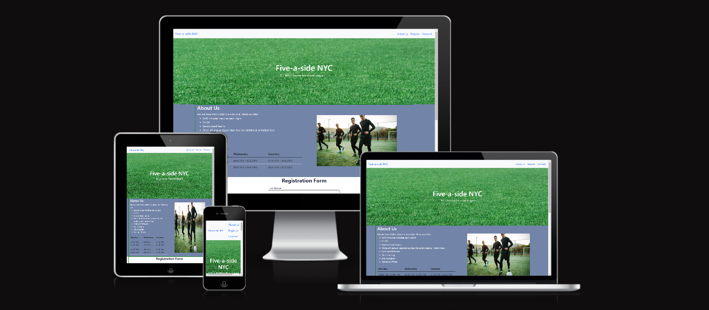
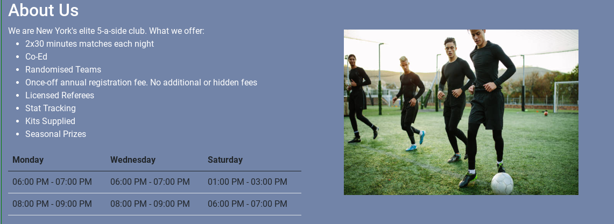
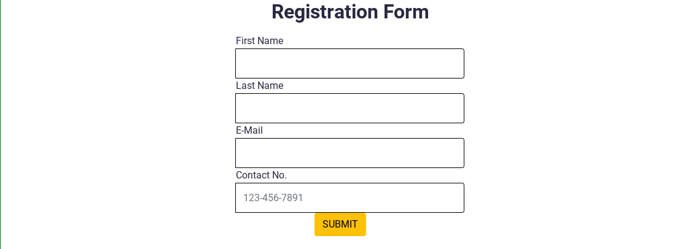
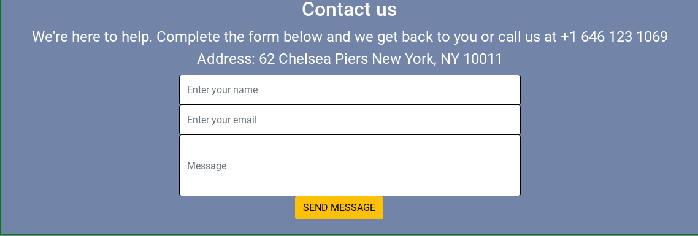
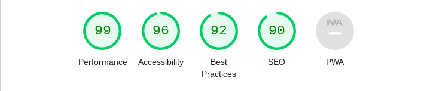

# NYC soccer. WEBSITE

## DESCRIPTION

This is the front-facing website of Five-a-side NYC. It's purpose is to advertise a five-a-side football club at chelsea piers in NYC.

Users of this website will able to find all the information they need to know about this football club
The page is divided into 3 sections:

-   About us: details of what the club offers and also a timetable of when the club plays matches
-   Registration form: A registration form to sign up for the club
-   Contact us: A contact form and phone number for the user to reach out to the club if they have any additional      questions about the club. This section also contains the address of the club where all the matches will be played.

## DEPLOYMENT AND LIVE DEMO

The site has been deployed to github and is accessible on [github pages]( https://jcurran1289.github.io/PP1-FiveASideNYC/).

## Features

### Navigation

-  Along the top of the page, the navigation bar displays the clubs name that links to the top of the page 
-  The other navigation links include: About Us, Register, Contact
-  The navigation makes it

### About Us
- The about us section provides the user with details of what the club offers it's members when they register
- This section also has a simple, easy to read table that gives the days and times the club plays their 5-a-side matches

### Register
- The Register section contains a form that collects the user's details so they can join the club.
- This form asks the user for their first name, last name, email and phone number so they can register

### Contact
- The contact section allows users to contact the administrators of the club. 
- This section contains a contact form where the user enters their name, email and the question they have about the club
- The contact section includes the address and phone number of the club
- This section is valuable to the user since it provides the user the information to contact if they need to and the address where the matches will be played

## TESTING

- Using the chrome devtools, I confirmed the website is responsive and functions on all screen sizes. see Responsiveness Testing section below
- I have confirmed that both forms work. they require entries in every field, will only accept numbers in the phone number field and emails in the email fields.
- Confirmed the submit and send message button works and open in a new tabs 
- I tested that this page works in different browsers: Chrome, Firefox, Microsoft Edge 
- Tested and confirmed that the three links (about us, register and contact us) in the navaigation bar bring the user to the appropriate section on the page 

### Validator Testing

- HTML
    - No errors when passed through the offcial W3C validator
- CSS
    - No errors when passed through the offcial JIGSAW validator
- Accessibility
    - Lighthouse in devtools confirmed the colours and fonts on the website are easy to read and accessible

### Responsiveness Testing
- I have tested the media queries in my css. the text size increases on smaller screens and decreases on bigger screens
- I tested the site on all the devices below and everything worked ok

| Device         | Browser | Screen Width |
|----------------|---------|--------------|
| iPhone SE      | Chrome  | 375 x 667    |
| iPhone 12 Pro  | Safari  | 390 x 844    |
| Samsung Galaxy | Chrome  | 412 x 914    |
| iPad Air       | Safari  | 820 x 1180   |

## Languages and Frameworks

-   HTML
-   CSS
-   Bootstrap

## Bugs
 - Nav bar was not wokring on smaller screens. to fix this i updated from bootstrap 3 to bootstrap 5.
 - When i updated from BS 3 to BS 5, the input boxes for both forms were to the left. i created the class "centered" to center all inputs in both forms
 - Deploy wesbite was not reading css. I fixed it by updated the link from /Assets/CSS/styles.css to Assets/CSS/styles.css 

## Deployment
The site was deployed to GitHub pages

The live link can be found [Five-a-side NYC]( https://jcurran1289.github.io/PP1-FiveASideNYC/).

## Credits
### Content
### Media
- The video was taken YouTube channel  [FairPlay Indoor Soccer Complex](https://www.youtube.com/channel/UCnKTEhr_UrLvtZlE-_wPkTw).